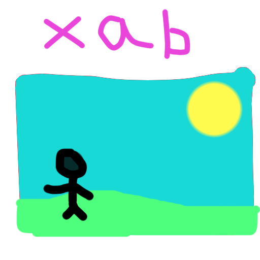

<!-- xab temporary name, probably -->

<!-- TODO: -->
<!-- TOC -->



__X11 Animated Background__

> [!WARNING]
> THIS PROJECT NOT FULLY BAKED YET AND MANY OF THE FEATURES ARE NOT IMPLEMENTED YET

---

### Run
xab \<path/to/file.mp4> \[options] \<path/to/another_file.gif> \[options]

example:
xab bg.mp4 --monitor=0 pixel_bg.gif --monitor=1 --pixelated=1

options:
* -M, --monitor=n     | which monitor to use (requires xrandr and cglm dependencies)                (default: 0)
* -v, --vsync=0|1     | synchronize framerate to monitor framerate                                  (default: 1)
* --max_framerate=0|n | limit framerate to n fps (overrides vsync)                                  (default: 0)

per video/monitor options:
* -p, --pixelated=0|1 | use bilinear instead of point filtering for rendering the background        (default: bilnear)
* --hw_accel=0|1      | use hardware acceleration for video decoding (hardware needs to support it) (default: 1)
<!-- TODO -->
<!-- * -x, --offset_x=n    | offset wallpaper x coordinate (default: 0) -->
<!-- * -y, --offset_y=n    | offset wallpaper y coordinate (default: 0) -->

> [!NOTE]
> hardware accelerated video decoding and max framerate are not implemented yet

<!-- readme totally not similar to picom lol -->

#### Hardware requirements
Anything that supports OpenGL 3.3.

#### Supported file formats
Anything that ffmpeg (libav) supports

## Build

### Dependencies

Assuming you already have the building tools installed (e.g. gcc, meson, etc.), you still need:
* xcb
* xcb-util
* xproto
* libepoxy
* xcb-randr version >= 1.5 recommended (optional but required for multi monitor support)
* cglm version >= 0.8.4 (optional but required for multi monitor support)
* libGL
* libEGL
* libavutil
* libavcodec
* libavformat
* libavfilter
* libswscale

On Debian distributions (e.g. Ubuntu), the needed packages are
```sh
sudo apt-get install \
    libepoxy-dev \
    libxcb1-dev libxcb-util0-dev \
    libavcodec-dev libavformat-dev libavfilter-dev libavutil-dev libswresample-dev libswscale-dev
```


<details>
<summary>Optional dependencies on Debian distributions</summary>

```sh
# xcb-randr
sudo apt-get install libxcb-randr-dev

# cglm
sudo apt-get install libcglm-dev
```

</details>

<br>

TODO: fedora and arch <!-- maybe -->

### Setup
```sh
meson setup build --buildtype=release
```

### To build
```sh
meson -C build
```
Built binary can be found in `build/xab`

---

### To install
```sh
ninja -C build install
```
this will install xab at `/usr/local/bin` (probably)


---

### Compilation databases

```sh
cp build/compile_commands.json .
```

---

<details>
<summary>meson options</summary>

```sh
# enable verbose logging
meson setup build -Dverbose=true
```
</details>
